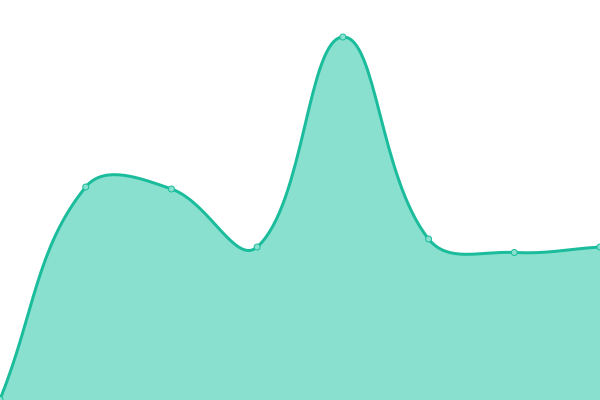
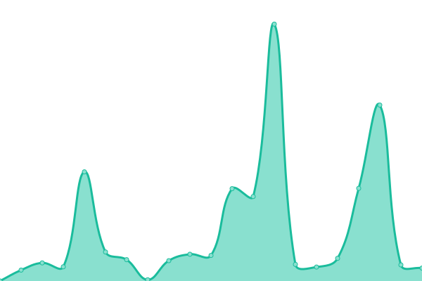

# [📈 Live Status](https://servicesite.github.io/upptime): <!--live status--> **🟩 All systems operational**

This repository contains the open-source uptime monitor and status page for [Service Site](https://servicesite.co.uk), powered by [Upptime](https://github.com/upptime/upptime).

With [Upptime](https://upptime.js.org), you can get your own unlimited and free uptime monitor and status page, powered entirely by a GitHub repository. We use [Issues](https://github.com/upptime/upptime/issues) as incident reports, [Actions](https://github.com/servicesite/upptime/actions) as uptime monitors, and [Pages](https://upptime.github.io/upptime) for the status page.

<!--start: status pages-->
<!-- This summary is generated by Upptime (https://github.com/upptime/upptime) -->
<!-- Do not edit this manually, your changes will be overwritten -->
<!-- prettier-ignore -->
| URL | Status | History | Response Time | Uptime |
| --- | ------ | ------- | ------------- | ------ |
|  [Google](https://www.google.com) | 🟩 Up | [google.yml](https://github.com/servicesite/upptime/commits/HEAD/history/google.yml) | 

 109ms
     
 | 

<a href="https://servicesite.github.io/upptime/history/google">100.00%</a>
    

|  [Amazon](https://www.amazon.com) | 🟩 Up | [amazon.yml](https://github.com/servicesite/upptime/commits/HEAD/history/amazon.yml) | 

 233ms
     
 | 

<a href="https://servicesite.github.io/upptime/history/amazon">100.00%</a>
    

|  [Facebook](https://www.facebook.com) | 🟩 Up | [facebook.yml](https://github.com/servicesite/upptime/commits/HEAD/history/facebook.yml) | 

 315ms
     
 | 

<a href="https://servicesite.github.io/upptime/history/facebook">100.00%</a>
    

|  [Apple](https://www.apple.com) | 🟩 Up | [apple.yml](https://github.com/servicesite/upptime/commits/HEAD/history/apple.yml) | 

 253ms
     
 | 

<a href="https://servicesite.github.io/upptime/history/apple">100.00%</a>
    

|  [Typeform (Cookers)](https://servicesite.typeform.com/to/wnhhHH) | 🟩 Up | [typeform-cookers.yml](https://github.com/servicesite/upptime/commits/HEAD/history/typeform-cookers.yml) | 

 256ms
     
 | 

<a href="https://servicesite.github.io/upptime/history/typeform-cookers">99.02%</a>
    

|  [Typeform (Dishwashers)](https://servicesite.typeform.com/to/AwT0or) | 🟩 Up | [typeform-dishwashers.yml](https://github.com/servicesite/upptime/commits/HEAD/history/typeform-dishwashers.yml) | 

 83ms
     
 | 

<a href="https://servicesite.github.io/upptime/history/typeform-dishwashers">99.02%</a>
    

|  [Typeform (Fridges & Freezers)](https://servicesite.typeform.com/to/HMORmA) | 🟩 Up | [typeform-fridges-and-freezers.yml](https://github.com/servicesite/upptime/commits/HEAD/history/typeform-fridges-and-freezers.yml) | 

 80ms
     
 | 

<a href="https://servicesite.github.io/upptime/history/typeform-fridges-and-freezers">90.67%</a>
    

|  [Typeform (Tumble Dryers)](https://servicesite.typeform.com/to/Nh0AP2) | 🟩 Up | [typeform-tumble-dryers.yml](https://github.com/servicesite/upptime/commits/HEAD/history/typeform-tumble-dryers.yml) | 

 89ms
     
 | 

<a href="https://servicesite.github.io/upptime/history/typeform-tumble-dryers">99.02%</a>
    

|  [Typeform (Washing Machines)](https://servicesite.typeform.com/to/HRoI5H) | 🟩 Up | [typeform-washing-machines.yml](https://github.com/servicesite/upptime/commits/HEAD/history/typeform-washing-machines.yml) | 

 87ms
     
 | 

<a href="https://servicesite.github.io/upptime/history/typeform-washing-machines">99.02%</a>
    

|  [Service Site](https://www.servicesite.co.uk) | 🟩 Up | [service-site.yml](https://github.com/servicesite/upptime/commits/HEAD/history/service-site.yml) | 

 1588ms
     
 | 

<a href="https://servicesite.github.io/upptime/history/service-site">100.00%</a>
    

|  Service Site API | 🟩 Up | [service-site-api.yml](https://github.com/servicesite/upptime/commits/HEAD/history/service-site-api.yml) | 

 384ms
     
 | 

<a href="https://servicesite.github.io/upptime/history/service-site-api">100.00%</a>
    

|  [Aberdeen Repairs](https://aberdeen-repairs.co.uk) | 🟩 Up | [aberdeen-repairs.yml](https://github.com/servicesite/upptime/commits/HEAD/history/aberdeen-repairs.yml) | 

 549ms
     
 | 

<a href="https://servicesite.github.io/upptime/history/aberdeen-repairs">22.78%</a>
    

|  [Barnsley Repairs](https://barnsleyrepairs.co.uk) | 🟩 Up | [barnsley-repairs.yml](https://github.com/servicesite/upptime/commits/HEAD/history/barnsley-repairs.yml) | 

 346ms
     
 | 

<a href="https://servicesite.github.io/upptime/history/barnsley-repairs">0.00%</a>
    

|  [Bath Repairs](https://bath-repairs.co.uk) | 🟩 Up | [bath-repairs.yml](https://github.com/servicesite/upptime/commits/HEAD/history/bath-repairs.yml) | 

 327ms
     
 | 

<a href="https://servicesite.github.io/upptime/history/bath-repairs">100.00%</a>
    

|  [Belfast Repairs](https://belfastrepairs.co.uk) | 🟩 Up | [belfast-repairs.yml](https://github.com/servicesite/upptime/commits/HEAD/history/belfast-repairs.yml) | 

 315ms
     
 | 

<a href="https://servicesite.github.io/upptime/history/belfast-repairs">99.91%</a>
    

|  [Birmingham Repairs](https://birminghamrepairs.co.uk) | 🟩 Up | [birmingham-repairs.yml](https://github.com/servicesite/upptime/commits/HEAD/history/birmingham-repairs.yml) | 

 528ms
     
 | 

<a href="https://servicesite.github.io/upptime/history/birmingham-repairs">99.85%</a>
    

|  [Blackburn Repairs](https://blackburnrepairs.co.uk) | 🟩 Up | [blackburn-repairs.yml](https://github.com/servicesite/upptime/commits/HEAD/history/blackburn-repairs.yml) | 

 225ms
     
 | 

<a href="https://servicesite.github.io/upptime/history/blackburn-repairs">96.89%</a>
    

|  [Blackpool Repairs](https://blackpoolrepairs.co.uk) | 🟩 Up | [blackpool-repairs.yml](https://github.com/servicesite/upptime/commits/HEAD/history/blackpool-repairs.yml) | 

 548ms
     
 | 

<a href="https://servicesite.github.io/upptime/history/blackpool-repairs">99.82%</a>
    

|  [Bolton Repairs](https://boltonrepairs.co.uk) | 🟩 Up | [bolton-repairs.yml](https://github.com/servicesite/upptime/commits/HEAD/history/bolton-repairs.yml) | 

 502ms
     
 | 

<a href="https://servicesite.github.io/upptime/history/bolton-repairs">99.92%</a>
    

|  [Bournemouth Repairs](https://bournemouthrepairs.co.uk) | 🟩 Up | [bournemouth-repairs.yml](https://github.com/servicesite/upptime/commits/HEAD/history/bournemouth-repairs.yml) | 

 539ms
     
 | 

<a href="https://servicesite.github.io/upptime/history/bournemouth-repairs">99.85%</a>
    

|  [Bradford Repairs](https://bradfordrepairs.co.uk) | 🟩 Up | [bradford-repairs.yml](https://github.com/servicesite/upptime/commits/HEAD/history/bradford-repairs.yml) | 

 182ms
     
 | 

<a href="https://servicesite.github.io/upptime/history/bradford-repairs">96.89%</a>
    

|  [Brighton Repairs](https://brightonrepairs.co.uk) | 🟩 Up | [brighton-repairs.yml](https://github.com/servicesite/upptime/commits/HEAD/history/brighton-repairs.yml) | 

 498ms
     
 | 

<a href="https://servicesite.github.io/upptime/history/brighton-repairs">99.83%</a>
    

|  [Bristol Repairs](https://bristolrepairs.co.uk) | 🟩 Up | [bristol-repairs.yml](https://github.com/servicesite/upptime/commits/HEAD/history/bristol-repairs.yml) | 

 565ms
     
 | 

<a href="https://servicesite.github.io/upptime/history/bristol-repairs">99.91%</a>
    

|  [Bromley Repairs](https://bromleyrepairs.co.uk) | 🟩 Up | [bromley-repairs.yml](https://github.com/servicesite/upptime/commits/HEAD/history/bromley-repairs.yml) | 

 207ms
     
 | 

<a href="https://servicesite.github.io/upptime/history/bromley-repairs">100.00%</a>
    

|  [Cambridge Repairs](https://cambridgerepairs.co.uk) | 🟩 Up | [cambridge-repairs.yml](https://github.com/servicesite/upptime/commits/HEAD/history/cambridge-repairs.yml) | 

 204ms
     
 | 

<a href="https://servicesite.github.io/upptime/history/cambridge-repairs">0.00%</a>
    

|  [Canterbury Repairs](https://canterburyrepairs.co.uk) | 🟩 Up | [canterbury-repairs.yml](https://github.com/servicesite/upptime/commits/HEAD/history/canterbury-repairs.yml) | 

 222ms
     
 | 

<a href="https://servicesite.github.io/upptime/history/canterbury-repairs">100.00%</a>
    

|  [Cardiff Repairs](https://cardiffrepairs.co.uk) | 🟩 Up | [cardiff-repairs.yml](https://github.com/servicesite/upptime/commits/HEAD/history/cardiff-repairs.yml) | 

 229ms
     
 | 

<a href="https://servicesite.github.io/upptime/history/cardiff-repairs">99.83%</a>
    

|  [Carlisle Repairs](https://carlislerepairs.co.uk) | 🟩 Up | [carlisle-repairs.yml](https://github.com/servicesite/upptime/commits/HEAD/history/carlisle-repairs.yml) | 

 976ms
     
 | 

<a href="https://servicesite.github.io/upptime/history/carlisle-repairs">2.79%</a>
    

|  [Chatham Repairs](https://chathamrepairs.co.uk) | 🟩 Up | [chatham-repairs.yml](https://github.com/servicesite/upptime/commits/HEAD/history/chatham-repairs.yml) | 

 727ms
     
 | 

<a href="https://servicesite.github.io/upptime/history/chatham-repairs">99.83%</a>
    

|  [Chelmsford Repairs](https://chelmsford-repairs.co.uk) | 🟩 Up | [chelmsford-repairs.yml](https://github.com/servicesite/upptime/commits/HEAD/history/chelmsford-repairs.yml) | 

 584ms
     
 | 

<a href="https://servicesite.github.io/upptime/history/chelmsford-repairs">99.76%</a>
    

|  [Chester Repairs](https://chester-repairs.co.uk) | 🟩 Up | [chester-repairs.yml](https://github.com/servicesite/upptime/commits/HEAD/history/chester-repairs.yml) | 

 716ms
     
 | 

<a href="https://servicesite.github.io/upptime/history/chester-repairs">99.83%</a>
    

|  [Chesterfield Repairs](https://chesterfieldrepairs.co.uk) | 🟩 Up | [chesterfield-repairs.yml](https://github.com/servicesite/upptime/commits/HEAD/history/chesterfield-repairs.yml) | 

 1006ms
     
 | 

<a href="https://servicesite.github.io/upptime/history/chesterfield-repairs">99.92%</a>
    

|  [Colchester Repairs](https://colchester-repairs.co.uk) | 🟩 Up | [colchester-repairs.yml](https://github.com/servicesite/upptime/commits/HEAD/history/colchester-repairs.yml) | 

 783ms
     
 | 

<a href="https://servicesite.github.io/upptime/history/colchester-repairs">100.00%</a>
    

|  [Coventry Repairs](https://coventryrepairs.co.uk) | 🟩 Up | [coventry-repairs.yml](https://github.com/servicesite/upptime/commits/HEAD/history/coventry-repairs.yml) | 

 202ms
     
 | 

<a href="https://servicesite.github.io/upptime/history/coventry-repairs">100.00%</a>
    

|  [Crewe Repairs](https://crewerepairs.co.uk) | 🟩 Up | [crewe-repairs.yml](https://github.com/servicesite/upptime/commits/HEAD/history/crewe-repairs.yml) | 

 804ms
     
 | 

<a href="https://servicesite.github.io/upptime/history/crewe-repairs">99.91%</a>
    

|  [Croydon Repairs](https://croydonrepairs.co.uk) | 🟩 Up | [croydon-repairs.yml](https://github.com/servicesite/upptime/commits/HEAD/history/croydon-repairs.yml) | 

 520ms
     
 | 

<a href="https://servicesite.github.io/upptime/history/croydon-repairs">99.92%</a>
    

|  [Darlington Repairs](https://darlingtonrepairs.co.uk) | 🟩 Up | [darlington-repairs.yml](https://github.com/servicesite/upptime/commits/HEAD/history/darlington-repairs.yml) | 

 678ms
     
 | 

<a href="https://servicesite.github.io/upptime/history/darlington-repairs">99.91%</a>
    

|  [Dartford Repairs](https://dartford-repairs.co.uk) | 🟩 Up | [dartford-repairs.yml](https://github.com/servicesite/upptime/commits/HEAD/history/dartford-repairs.yml) | 

 444ms
     
 | 

<a href="https://servicesite.github.io/upptime/history/dartford-repairs">96.89%</a>
    

|  [Derby Repairs](https://derby-repairs.co.uk) | 🟩 Up | [derby-repairs.yml](https://github.com/servicesite/upptime/commits/HEAD/history/derby-repairs.yml) | 

 188ms
     
 | 

<a href="https://servicesite.github.io/upptime/history/derby-repairs">22.70%</a>
    

|  [Doncaster Repairs](https://doncasterrepairs.co.uk) | 🟩 Up | [doncaster-repairs.yml](https://github.com/servicesite/upptime/commits/HEAD/history/doncaster-repairs.yml) | 

 653ms
     
 | 

<a href="https://servicesite.github.io/upptime/history/doncaster-repairs">100.00%</a>
    

|  [Dorchester Repairs](https://dorchesterrepairs.co.uk) | 🟩 Up | [dorchester-repairs.yml](https://github.com/servicesite/upptime/commits/HEAD/history/dorchester-repairs.yml) | 

 350ms
     
 | 

<a href="https://servicesite.github.io/upptime/history/dorchester-repairs">100.00%</a>
    

|  [Dorset Repairs](https://dorsetrepairs.co.uk) | 🟩 Up | [dorset-repairs.yml](https://github.com/servicesite/upptime/commits/HEAD/history/dorset-repairs.yml) | 

 678ms
     
 | 

<a href="https://servicesite.github.io/upptime/history/dorset-repairs">99.91%</a>
    

|  [Dudley Repairs](https://dudleyrepairs.co.uk) | 🟩 Up | [dudley-repairs.yml](https://github.com/servicesite/upptime/commits/HEAD/history/dudley-repairs.yml) | 

 373ms
     
 | 

<a href="https://servicesite.github.io/upptime/history/dudley-repairs">100.00%</a>
    

|  [Dumfries Repairs](https://dumfriesrepairs.co.uk) | 🟩 Up | [dumfries-repairs.yml](https://github.com/servicesite/upptime/commits/HEAD/history/dumfries-repairs.yml) | 

 456ms
     
 | 

<a href="https://servicesite.github.io/upptime/history/dumfries-repairs">96.89%</a>
    

|  [Dundee Repairs](https://dundeerepairs.co.uk) | 🟩 Up | [dundee-repairs.yml](https://github.com/servicesite/upptime/commits/HEAD/history/dundee-repairs.yml) | 

 597ms
     
 | 

<a href="https://servicesite.github.io/upptime/history/dundee-repairs">99.91%</a>
    

|  [Durham Repairs](https://durhamrepairs.co.uk) | 🟩 Up | [durham-repairs.yml](https://github.com/servicesite/upptime/commits/HEAD/history/durham-repairs.yml) | 

 212ms
     
 | 

<a href="https://servicesite.github.io/upptime/history/durham-repairs">96.89%</a>
    

|  [Edinburgh Repairs](https://edinburgh-repairs.co.uk) | 🟩 Up | [edinburgh-repairs.yml](https://github.com/servicesite/upptime/commits/HEAD/history/edinburgh-repairs.yml) | 

 562ms
     
 | 

<a href="https://servicesite.github.io/upptime/history/edinburgh-repairs">100.00%</a>
    

|  [Enfield Repairs](https://enfieldrepairs.co.uk) | 🟩 Up | [enfield-repairs.yml](https://github.com/servicesite/upptime/commits/HEAD/history/enfield-repairs.yml) | 

 617ms
     
 | 

<a href="https://servicesite.github.io/upptime/history/enfield-repairs">100.00%</a>
    

|  [Exeter Repairs](https://exeterrepairs.co.uk) | 🟩 Up | [exeter-repairs.yml](https://github.com/servicesite/upptime/commits/HEAD/history/exeter-repairs.yml) | 

 515ms
     
 | 

<a href="https://servicesite.github.io/upptime/history/exeter-repairs">100.00%</a>
    

|  [Falkirk Repairs](https://falkirkrepairs.co.uk) | 🟩 Up | [falkirk-repairs.yml](https://github.com/servicesite/upptime/commits/HEAD/history/falkirk-repairs.yml) | 

 581ms
     
 | 

<a href="https://servicesite.github.io/upptime/history/falkirk-repairs">96.89%</a>
    

|  [Fife Repairs](https://fiferepairs.co.uk) | 🟩 Up | [fife-repairs.yml](https://github.com/servicesite/upptime/commits/HEAD/history/fife-repairs.yml) | 

 580ms
     
 | 

<a href="https://servicesite.github.io/upptime/history/fife-repairs">99.91%</a>
    

|  [Glasgow Repairs](https://glasgowrepairs.co.uk) | 🟩 Up | [glasgow-repairs.yml](https://github.com/servicesite/upptime/commits/HEAD/history/glasgow-repairs.yml) | 

 512ms
     
 | 

<a href="https://servicesite.github.io/upptime/history/glasgow-repairs">99.91%</a>
    

|  [Gloucester Repairs](https://gloucesterrepairs.co.uk) | 🟩 Up | [gloucester-repairs.yml](https://github.com/servicesite/upptime/commits/HEAD/history/gloucester-repairs.yml) | 

 755ms
     
 | 

<a href="https://servicesite.github.io/upptime/history/gloucester-repairs">99.91%</a>
    

|  [Guildford Repairs](https://guildfordrepairs.co.uk) | 🟩 Up | [guildford-repairs.yml](https://github.com/servicesite/upptime/commits/HEAD/history/guildford-repairs.yml) | 

 234ms
     
 | 

<a href="https://servicesite.github.io/upptime/history/guildford-repairs">48.55%</a>
    

|  [Halifax Repairs](https://halifaxrepairs.co.uk) | 🟩 Up | [halifax-repairs.yml](https://github.com/servicesite/upptime/commits/HEAD/history/halifax-repairs.yml) | 

 605ms
     
 | 

<a href="https://servicesite.github.io/upptime/history/halifax-repairs">99.91%</a>
    

|  [Harrogate Repairs](https://harrogaterepairs.co.uk) | 🟩 Up | [harrogate-repairs.yml](https://github.com/servicesite/upptime/commits/HEAD/history/harrogate-repairs.yml) | 

 178ms
     
 | 

<a href="https://servicesite.github.io/upptime/history/harrogate-repairs">0.00%</a>
    

|  [Harrow Repairs](https://harrowrepairs.co.uk) | 🟩 Up | [harrow-repairs.yml](https://github.com/servicesite/upptime/commits/HEAD/history/harrow-repairs.yml) | 

 542ms
     
 | 

<a href="https://servicesite.github.io/upptime/history/harrow-repairs">2.87%</a>
    

|  [Hemel Hempstead Repairs](https://hemelhempsteadrepairs.co.uk) | 🟩 Up | [hemel-hempstead-repairs.yml](https://github.com/servicesite/upptime/commits/HEAD/history/hemel-hempstead-repairs.yml) | 

 540ms
     
 | 

<a href="https://servicesite.github.io/upptime/history/hemel-hempstead-repairs">99.91%</a>
    

|  [Hereford Repairs](https://herefordrepairs.co.uk) | 🟩 Up | [hereford-repairs.yml](https://github.com/servicesite/upptime/commits/HEAD/history/hereford-repairs.yml) | 

 596ms
     
 | 

<a href="https://servicesite.github.io/upptime/history/hereford-repairs">100.00%</a>
    

|  [Highlands Repairs](https://highlandsrepairs.co.uk) | 🟩 Up | [highlands-repairs.yml](https://github.com/servicesite/upptime/commits/HEAD/history/highlands-repairs.yml) | 

 335ms
     
 | 

<a href="https://servicesite.github.io/upptime/history/highlands-repairs">0.00%</a>
    

|  [Huddersfield Repairs](https://huddersfieldrepairs.co.uk) | 🟩 Up | [huddersfield-repairs.yml](https://github.com/servicesite/upptime/commits/HEAD/history/huddersfield-repairs.yml) | 

 203ms
     
 | 

<a href="https://servicesite.github.io/upptime/history/huddersfield-repairs">96.89%</a>
    

|  [Hull Repairs](https://hullrepairs.co.uk) | 🟩 Up | [hull-repairs.yml](https://github.com/servicesite/upptime/commits/HEAD/history/hull-repairs.yml) | 

 557ms
     
 | 

<a href="https://servicesite.github.io/upptime/history/hull-repairs">99.91%</a>
    

|  [Ilford Repairs](https://ilfordrepairs.co.uk) | 🟩 Up | [ilford-repairs.yml](https://github.com/servicesite/upptime/commits/HEAD/history/ilford-repairs.yml) | 

 198ms
     
 | 

<a href="https://servicesite.github.io/upptime/history/ilford-repairs">96.89%</a>
    

|  [Inverness Repairs](https://invernessrepairs.co.uk) | 🟩 Up | [inverness-repairs.yml](https://github.com/servicesite/upptime/commits/HEAD/history/inverness-repairs.yml) | 

 190ms
     
 | 

<a href="https://servicesite.github.io/upptime/history/inverness-repairs">96.90%</a>
    

|  [Ipswich Repairs](https://ipswich-repairs.co.uk) | 🟩 Up | [ipswich-repairs.yml](https://github.com/servicesite/upptime/commits/HEAD/history/ipswich-repairs.yml) | 

 569ms
     
 | 

<a href="https://servicesite.github.io/upptime/history/ipswich-repairs">99.61%</a>
    

|  [Isle of Lewis Repairs](https://isleoflewisrepairs.co.uk) | 🟩 Up | [isle-of-lewis-repairs.yml](https://github.com/servicesite/upptime/commits/HEAD/history/isle-of-lewis-repairs.yml) | 

 368ms
     
 | 

<a href="https://servicesite.github.io/upptime/history/isle-of-lewis-repairs">96.90%</a>
    

|  [Isle of Wight Repairs](https://iowrepairs.co.uk) | 🟩 Up | [isle-of-wight-repairs.yml](https://github.com/servicesite/upptime/commits/HEAD/history/isle-of-wight-repairs.yml) | 

 195ms
     
 | 

<a href="https://servicesite.github.io/upptime/history/isle-of-wight-repairs">100.00%</a>
    

|  [Kent Repairs](https://kentrepairs.co.uk) | 🟩 Up | [kent-repairs.yml](https://github.com/servicesite/upptime/commits/HEAD/history/kent-repairs.yml) | 

 229ms
     
 | 

<a href="https://servicesite.github.io/upptime/history/kent-repairs">100.00%</a>
    

|  [Kilmarnock Repairs](https://kilmarnockrepairs.co.uk) | 🟩 Up | [kilmarnock-repairs.yml](https://github.com/servicesite/upptime/commits/HEAD/history/kilmarnock-repairs.yml) | 

 516ms
     
 | 

<a href="https://servicesite.github.io/upptime/history/kilmarnock-repairs">100.00%</a>
    

|  [Kingston Repairs](https://kingstonrepairs.co.uk) | 🟩 Up | [kingston-repairs.yml](https://github.com/servicesite/upptime/commits/HEAD/history/kingston-repairs.yml) | 

 194ms
     
 | 

<a href="https://servicesite.github.io/upptime/history/kingston-repairs">100.00%</a>
    

|  [Lancaster Repairs](https://lancasterrepairs.co.uk) | 🟩 Up | [lancaster-repairs.yml](https://github.com/servicesite/upptime/commits/HEAD/history/lancaster-repairs.yml) | 

 480ms
     
 | 

<a href="https://servicesite.github.io/upptime/history/lancaster-repairs">100.00%</a>
    

|  [Leeds Repairs](https://leedsrepairs.co.uk) | 🟩 Up | [leeds-repairs.yml](https://github.com/servicesite/upptime/commits/HEAD/history/leeds-repairs.yml) | 

 250ms
     
 | 

<a href="https://servicesite.github.io/upptime/history/leeds-repairs">100.00%</a>
    

|  [Leicester Repairs](https://leicesterrepairs.co.uk) | 🟩 Up | [leicester-repairs.yml](https://github.com/servicesite/upptime/commits/HEAD/history/leicester-repairs.yml) | 

 346ms
     
 | 

<a href="https://servicesite.github.io/upptime/history/leicester-repairs">100.00%</a>
    

|  [Lincoln Repairs](https://lincolnrepairs.co.uk) | 🟩 Up | [lincoln-repairs.yml](https://github.com/servicesite/upptime/commits/HEAD/history/lincoln-repairs.yml) | 

 663ms
     
 | 

<a href="https://servicesite.github.io/upptime/history/lincoln-repairs">96.90%</a>
    

|  [Liverpool Repairs](https://liverpool-repairs.co.uk) | 🟩 Up | [liverpool-repairs.yml](https://github.com/servicesite/upptime/commits/HEAD/history/liverpool-repairs.yml) | 

 208ms
     
 | 

<a href="https://servicesite.github.io/upptime/history/liverpool-repairs">0.00%</a>
    

|  [Llandrindod Wells Repairs](https://llandrindodwellsrepairs.co.uk) | 🟩 Up | [llandrindod-wells-repairs.yml](https://github.com/servicesite/upptime/commits/HEAD/history/llandrindod-wells-repairs.yml) | 

 222ms
     
 | 

<a href="https://servicesite.github.io/upptime/history/llandrindod-wells-repairs">96.90%</a>
    

|  [London Repairs](https://london-repairs.co.uk) | 🟩 Up | [london-repairs.yml](https://github.com/servicesite/upptime/commits/HEAD/history/london-repairs.yml) | 

 549ms
     
 | 

<a href="https://servicesite.github.io/upptime/history/london-repairs">99.91%</a>
    

|  [Luton Repairs](https://lutonrepairs.co.uk) | 🟩 Up | [luton-repairs.yml](https://github.com/servicesite/upptime/commits/HEAD/history/luton-repairs.yml) | 

 404ms
     
 | 

<a href="https://servicesite.github.io/upptime/history/luton-repairs">96.90%</a>
    

|  [Maidstone Repairs](https://maidstonerepairs.co.uk) | 🟩 Up | [maidstone-repairs.yml](https://github.com/servicesite/upptime/commits/HEAD/history/maidstone-repairs.yml) | 

 534ms
     
 | 

<a href="https://servicesite.github.io/upptime/history/maidstone-repairs">100.00%</a>
    

|  [Manchester Repairs](https://manchester-repairs.co.uk) | 🟩 Up | [manchester-repairs.yml](https://github.com/servicesite/upptime/commits/HEAD/history/manchester-repairs.yml) | 

 506ms
     
 | 

<a href="https://servicesite.github.io/upptime/history/manchester-repairs">100.00%</a>
    

|  [Milton Keynes Repairs](https://miltonkeynesrepairs.co.uk) | 🟩 Up | [milton-keynes-repairs.yml](https://github.com/servicesite/upptime/commits/HEAD/history/milton-keynes-repairs.yml) | 

 200ms
     
 | 

<a href="https://servicesite.github.io/upptime/history/milton-keynes-repairs">100.00%</a>
    

|  [Motherwell Repairs](https://motherwellrepairs.co.uk) | 🟩 Up | [motherwell-repairs.yml](https://github.com/servicesite/upptime/commits/HEAD/history/motherwell-repairs.yml) | 

 545ms
     
 | 

<a href="https://servicesite.github.io/upptime/history/motherwell-repairs">100.00%</a>
    

|  [Newcastle Repairs](https://newcastlerepairs.co.uk) | 🟩 Up | [newcastle-repairs.yml](https://github.com/servicesite/upptime/commits/HEAD/history/newcastle-repairs.yml) | 

 604ms
     
 | 

<a href="https://servicesite.github.io/upptime/history/newcastle-repairs">100.00%</a>
    

|  [Newport Repairs](https://newportrepairs.co.uk) | 🟩 Up | [newport-repairs.yml](https://github.com/servicesite/upptime/commits/HEAD/history/newport-repairs.yml) | 

 185ms
     
 | 

<a href="https://servicesite.github.io/upptime/history/newport-repairs">96.90%</a>
    

|  [Norfolk Repairs](https://norfolkrepairs.co.uk) | 🟩 Up | [norfolk-repairs.yml](https://github.com/servicesite/upptime/commits/HEAD/history/norfolk-repairs.yml) | 

 314ms
     
 | 

<a href="https://servicesite.github.io/upptime/history/norfolk-repairs">100.00%</a>
    

|  [North Wales Repairs](https://northwalesrepairs.co.uk) | 🟩 Up | [north-wales-repairs.yml](https://github.com/servicesite/upptime/commits/HEAD/history/north-wales-repairs.yml) | 

 669ms
     
 | 

<a href="https://servicesite.github.io/upptime/history/north-wales-repairs">99.77%</a>
    

|  [Northampton Repairs](https://northamptonrepairs.co.uk) | 🟩 Up | [northampton-repairs.yml](https://github.com/servicesite/upptime/commits/HEAD/history/northampton-repairs.yml) | 

 1024ms
     
 | 

<a href="https://servicesite.github.io/upptime/history/northampton-repairs">100.00%</a>
    

|  [Norwich Repairs](https://norwich-repairs.co.uk) | 🟩 Up | [norwich-repairs.yml](https://github.com/servicesite/upptime/commits/HEAD/history/norwich-repairs.yml) | 

 355ms
     
 | 

<a href="https://servicesite.github.io/upptime/history/norwich-repairs">100.00%</a>
    

|  [Nottingham Repairs](https://nottinghamrepairs.co.uk) | 🟩 Up | [nottingham-repairs.yml](https://github.com/servicesite/upptime/commits/HEAD/history/nottingham-repairs.yml) | 

 701ms
     
 | 

<a href="https://servicesite.github.io/upptime/history/nottingham-repairs">100.00%</a>
    

|  [Oldham Repairs](https://oldhamrepairs.co.uk) | 🟩 Up | [oldham-repairs.yml](https://github.com/servicesite/upptime/commits/HEAD/history/oldham-repairs.yml) | 

 530ms
     
 | 

<a href="https://servicesite.github.io/upptime/history/oldham-repairs">100.00%</a>
    

|  [Oxford Repairs](https://oxfordrepairs.co.uk) | 🟩 Up | [oxford-repairs.yml](https://github.com/servicesite/upptime/commits/HEAD/history/oxford-repairs.yml) | 

 242ms
     
 | 

<a href="https://servicesite.github.io/upptime/history/oxford-repairs">100.00%</a>
    

|  [Paisley Repairs](https://paisleyrepairs.co.uk) | 🟩 Up | [paisley-repairs.yml](https://github.com/servicesite/upptime/commits/HEAD/history/paisley-repairs.yml) | 

 633ms
     
 | 

<a href="https://servicesite.github.io/upptime/history/paisley-repairs">3.10%</a>
    

|  [Perth Repairs](https://perthrepairs.co.uk) | 🟩 Up | [perth-repairs.yml](https://github.com/servicesite/upptime/commits/HEAD/history/perth-repairs.yml) | 

 777ms
     
 | 

<a href="https://servicesite.github.io/upptime/history/perth-repairs">100.00%</a>
    

|  [Peterborough Repairs](https://peterboroughrepairs.co.uk) | 🟩 Up | [peterborough-repairs.yml](https://github.com/servicesite/upptime/commits/HEAD/history/peterborough-repairs.yml) | 

 653ms
     
 | 

<a href="https://servicesite.github.io/upptime/history/peterborough-repairs">100.00%</a>
    

|  [Plymouth Repairs](https://plymouthrepairs.co.uk) | 🟩 Up | [plymouth-repairs.yml](https://github.com/servicesite/upptime/commits/HEAD/history/plymouth-repairs.yml) | 

 190ms
     
 | 

<a href="https://servicesite.github.io/upptime/history/plymouth-repairs">2.87%</a>
    

|  [Poole Repairs](https://poolerepairs.co.uk) | 🟩 Up | [poole-repairs.yml](https://github.com/servicesite/upptime/commits/HEAD/history/poole-repairs.yml) | 

 888ms
     
 | 

<a href="https://servicesite.github.io/upptime/history/poole-repairs">100.00%</a>
    

|  [Portsmouth Repairs](https://portsmouthrepairs.co.uk) | 🟩 Up | [portsmouth-repairs.yml](https://github.com/servicesite/upptime/commits/HEAD/history/portsmouth-repairs.yml) | 

 200ms
     
 | 

<a href="https://servicesite.github.io/upptime/history/portsmouth-repairs">0.00%</a>
    

|  [Preston Repairs](https://prestonrepairs.co.uk) | 🟩 Up | [preston-repairs.yml](https://github.com/servicesite/upptime/commits/HEAD/history/preston-repairs.yml) | 

 211ms
     
 | 

<a href="https://servicesite.github.io/upptime/history/preston-repairs">0.00%</a>
    

|  [Reading Repairs](https://readingrepairs.co.uk) | 🟩 Up | [reading-repairs.yml](https://github.com/servicesite/upptime/commits/HEAD/history/reading-repairs.yml) | 

 574ms
     
 | 

<a href="https://servicesite.github.io/upptime/history/reading-repairs">100.00%</a>
    

|  [Redhill Repairs](https://redhillrepairs.co.uk) | 🟩 Up | [redhill-repairs.yml](https://github.com/servicesite/upptime/commits/HEAD/history/redhill-repairs.yml) | 

 549ms
     
 | 

<a href="https://servicesite.github.io/upptime/history/redhill-repairs">99.77%</a>
    

|  [Romford Repairs](https://romfordrepairs.co.uk) | 🟩 Up | [romford-repairs.yml](https://github.com/servicesite/upptime/commits/HEAD/history/romford-repairs.yml) | 

 209ms
     
 | 

<a href="https://servicesite.github.io/upptime/history/romford-repairs">100.00%</a>
    

|  [Rotherham Repairs](https://rotherhamrepairs.co.uk) | 🟩 Up | [rotherham-repairs.yml](https://github.com/servicesite/upptime/commits/HEAD/history/rotherham-repairs.yml) | 

 530ms
     
 | 

<a href="https://servicesite.github.io/upptime/history/rotherham-repairs">100.00%</a>
    

|  [Salford Repairs](https://salfordrepairs.co.uk) | 🟩 Up | [salford-repairs.yml](https://github.com/servicesite/upptime/commits/HEAD/history/salford-repairs.yml) | 

 561ms
     
 | 

<a href="https://servicesite.github.io/upptime/history/salford-repairs">3.10%</a>
    

|  [Salisbury Repairs](https://salisburyrepairs.co.uk) | 🟩 Up | [salisbury-repairs.yml](https://github.com/servicesite/upptime/commits/HEAD/history/salisbury-repairs.yml) | 

 228ms
     
 | 

<a href="https://servicesite.github.io/upptime/history/salisbury-repairs">100.00%</a>
    

|  [Sheffield Repairs](https://sheffieldrepairs.co.uk) | 🟩 Up | [sheffield-repairs.yml](https://github.com/servicesite/upptime/commits/HEAD/history/sheffield-repairs.yml) | 

 543ms
     
 | 

<a href="https://servicesite.github.io/upptime/history/sheffield-repairs">100.00%</a>
    

|  [Shetland Repairs](https://shetlandrepairs.co.uk) | 🟩 Up | [shetland-repairs.yml](https://github.com/servicesite/upptime/commits/HEAD/history/shetland-repairs.yml) | 

 321ms
     
 | 

<a href="https://servicesite.github.io/upptime/history/shetland-repairs">96.91%</a>
    

|  [Shrewsbury Repairs](https://shrewsburyrepairs.co.uk) | 🟩 Up | [shrewsbury-repairs.yml](https://github.com/servicesite/upptime/commits/HEAD/history/shrewsbury-repairs.yml) | 

 688ms
     
 | 

<a href="https://servicesite.github.io/upptime/history/shrewsbury-repairs">2.87%</a>
    

|  [Slough Repairs](https://sloughrepairs.co.uk) | 🟩 Up | [slough-repairs.yml](https://github.com/servicesite/upptime/commits/HEAD/history/slough-repairs.yml) | 

 595ms
     
 | 

<a href="https://servicesite.github.io/upptime/history/slough-repairs">99.78%</a>
    

|  [Southampton Repairs](https://southampton-repairs.co.uk) | 🟩 Up | [southampton-repairs.yml](https://github.com/servicesite/upptime/commits/HEAD/history/southampton-repairs.yml) | 

 212ms
     
 | 

<a href="https://servicesite.github.io/upptime/history/southampton-repairs">100.00%</a>
    

|  [Southend Repairs](https://southendrepairs.co.uk) | 🟩 Up | [southend-repairs.yml](https://github.com/servicesite/upptime/commits/HEAD/history/southend-repairs.yml) | 

 222ms
     
 | 

<a href="https://servicesite.github.io/upptime/history/southend-repairs">100.00%</a>
    

|  [St. Albans Repairs](https://st-albans-repairs.co.uk) | 🟩 Up | [st-albans-repairs.yml](https://github.com/servicesite/upptime/commits/HEAD/history/st-albans-repairs.yml) | 

 329ms
     
 | 

<a href="https://servicesite.github.io/upptime/history/st-albans-repairs">100.00%</a>
    

|  [Stevenage Repairs](https://stevenagerepairs.co.uk) | 🟩 Up | [stevenage-repairs.yml](https://github.com/servicesite/upptime/commits/HEAD/history/stevenage-repairs.yml) | 

 1122ms
     
 | 

<a href="https://servicesite.github.io/upptime/history/stevenage-repairs">100.00%</a>
    

|  [Stirling Repairs](https://stirlingrepairs.co.uk) | 🟩 Up | [stirling-repairs.yml](https://github.com/servicesite/upptime/commits/HEAD/history/stirling-repairs.yml) | 

 573ms
     
 | 

<a href="https://servicesite.github.io/upptime/history/stirling-repairs">99.78%</a>
    

|  [Stockport Repairs](https://stockport-repairs.co.uk) | 🟩 Up | [stockport-repairs.yml](https://github.com/servicesite/upptime/commits/HEAD/history/stockport-repairs.yml) | 

 548ms
     
 | 

<a href="https://servicesite.github.io/upptime/history/stockport-repairs">100.00%</a>
    

|  [Stoke-on-Trent Repairs](https://stokeontrentrepairs.co.uk) | 🟩 Up | [stoke-on-trent-repairs.yml](https://github.com/servicesite/upptime/commits/HEAD/history/stoke-on-trent-repairs.yml) | 

 604ms
     
 | 

<a href="https://servicesite.github.io/upptime/history/stoke-on-trent-repairs">100.00%</a>
    

|  [Sunderland Repairs](https://sunderlandrepairs.co.uk) | 🟩 Up | [sunderland-repairs.yml](https://github.com/servicesite/upptime/commits/HEAD/history/sunderland-repairs.yml) | 

 534ms
     
 | 

<a href="https://servicesite.github.io/upptime/history/sunderland-repairs">100.00%</a>
    

|  [Sutton Repairs](https://suttonrepairs.co.uk) | 🟩 Up | [sutton-repairs.yml](https://github.com/servicesite/upptime/commits/HEAD/history/sutton-repairs.yml) | 

 424ms
     
 | 

<a href="https://servicesite.github.io/upptime/history/sutton-repairs">100.00%</a>
    

|  [Swansea Repairs](https://swansearepairs.co.uk) | 🟩 Up | [swansea-repairs.yml](https://github.com/servicesite/upptime/commits/HEAD/history/swansea-repairs.yml) | 

 345ms
     
 | 

<a href="https://servicesite.github.io/upptime/history/swansea-repairs">100.00%</a>
    

|  [Swindon Repairs](https://swindonrepairs.co.uk) | 🟩 Up | [swindon-repairs.yml](https://github.com/servicesite/upptime/commits/HEAD/history/swindon-repairs.yml) | 

 557ms
     
 | 

<a href="https://servicesite.github.io/upptime/history/swindon-repairs">100.00%</a>
    

|  [Taunton Repairs](https://tauntonrepairs.co.uk) | 🟩 Up | [taunton-repairs.yml](https://github.com/servicesite/upptime/commits/HEAD/history/taunton-repairs.yml) | 

 688ms
     
 | 

<a href="https://servicesite.github.io/upptime/history/taunton-repairs">100.00%</a>
    

|  [Teesside Repairs](https://teessiderepairs.co.uk) | 🟩 Up | [teesside-repairs.yml](https://github.com/servicesite/upptime/commits/HEAD/history/teesside-repairs.yml) | 

 571ms
     
 | 

<a href="https://servicesite.github.io/upptime/history/teesside-repairs">100.00%</a>
    

|  [Telford Repairs](https://telfordrepairs.co.uk) | 🟩 Up | [telford-repairs.yml](https://github.com/servicesite/upptime/commits/HEAD/history/telford-repairs.yml) | 

 588ms
     
 | 

<a href="https://servicesite.github.io/upptime/history/telford-repairs">100.00%</a>
    

|  [Tiverton Repairs](https://tivertonrepairs.co.uk) | 🟩 Up | [tiverton-repairs.yml](https://github.com/servicesite/upptime/commits/HEAD/history/tiverton-repairs.yml) | 

 187ms
     
 | 

<a href="https://servicesite.github.io/upptime/history/tiverton-repairs">100.00%</a>
    

|  [Torquay Repairs](https://torquayrepairs.co.uk) | 🟩 Up | [torquay-repairs.yml](https://github.com/servicesite/upptime/commits/HEAD/history/torquay-repairs.yml) | 

 523ms
     
 | 

<a href="https://servicesite.github.io/upptime/history/torquay-repairs">100.00%</a>
    

|  [Truro Repairs](https://trurorepairs.co.uk) | 🟩 Up | [truro-repairs.yml](https://github.com/servicesite/upptime/commits/HEAD/history/truro-repairs.yml) | 

 541ms
     
 | 

<a href="https://servicesite.github.io/upptime/history/truro-repairs">100.00%</a>
    

|  [Tunbridge Wells Repairs](https://tunbridgewellsrepairs.co.uk) | 🟩 Up | [tunbridge-wells-repairs.yml](https://github.com/servicesite/upptime/commits/HEAD/history/tunbridge-wells-repairs.yml) | 

 532ms
     
 | 

<a href="https://servicesite.github.io/upptime/history/tunbridge-wells-repairs">99.78%</a>
    

|  [Tweedbank Repairs](https://tweedbankrepairs.co.uk) | 🟩 Up | [tweedbank-repairs.yml](https://github.com/servicesite/upptime/commits/HEAD/history/tweedbank-repairs.yml) | 

 194ms
     
 | 

<a href="https://servicesite.github.io/upptime/history/tweedbank-repairs">100.00%</a>
    

|  [Twickenham Repairs](https://twickenhamrepairs.co.uk) | 🟩 Up | [twickenham-repairs.yml](https://github.com/servicesite/upptime/commits/HEAD/history/twickenham-repairs.yml) | 

 669ms
     
 | 

<a href="https://servicesite.github.io/upptime/history/twickenham-repairs">100.00%</a>
    

|  [Uxbridge Repairs](https://uxbridgerepairs.co.uk) | 🟩 Up | [uxbridge-repairs.yml](https://github.com/servicesite/upptime/commits/HEAD/history/uxbridge-repairs.yml) | 

 759ms
     
 | 

<a href="https://servicesite.github.io/upptime/history/uxbridge-repairs">100.00%</a>
    

|  [Wakefield Repairs](https://wakefield-repairs.co.uk) | 🟩 Up | [wakefield-repairs.yml](https://github.com/servicesite/upptime/commits/HEAD/history/wakefield-repairs.yml) | 

 856ms
     
 | 

<a href="https://servicesite.github.io/upptime/history/wakefield-repairs">3.09%</a>
    

|  [Walsall Repairs](https://walsallrepairs.co.uk) | 🟩 Up | [walsall-repairs.yml](https://github.com/servicesite/upptime/commits/HEAD/history/walsall-repairs.yml) | 

 544ms
     
 | 

<a href="https://servicesite.github.io/upptime/history/walsall-repairs">100.00%</a>
    

|  [Warrington Repairs](https://warringtonrepairs.co.uk) | 🟩 Up | [warrington-repairs.yml](https://github.com/servicesite/upptime/commits/HEAD/history/warrington-repairs.yml) | 

 237ms
     
 | 

<a href="https://servicesite.github.io/upptime/history/warrington-repairs">96.91%</a>
    

|  [Watford Repairs](https://watfordrepairs.co.uk) | 🟩 Up | [watford-repairs.yml](https://github.com/servicesite/upptime/commits/HEAD/history/watford-repairs.yml) | 

 307ms
     
 | 

<a href="https://servicesite.github.io/upptime/history/watford-repairs">100.00%</a>
    

|  [Weymouth Repairs](https://weymouthrepairs.co.uk) | 🟩 Up | [weymouth-repairs.yml](https://github.com/servicesite/upptime/commits/HEAD/history/weymouth-repairs.yml) | 

 688ms
     
 | 

<a href="https://servicesite.github.io/upptime/history/weymouth-repairs">100.00%</a>
    

|  [Wigan Repairs](https://wigan-repairs.co.uk) | 🟩 Up | [wigan-repairs.yml](https://github.com/servicesite/upptime/commits/HEAD/history/wigan-repairs.yml) | 

 209ms
     
 | 

<a href="https://servicesite.github.io/upptime/history/wigan-repairs">100.00%</a>
    

|  [Wolverhampton Repairs](https://wolverhamptonrepairs.co.uk) | 🟩 Up | [wolverhampton-repairs.yml](https://github.com/servicesite/upptime/commits/HEAD/history/wolverhampton-repairs.yml) | 

 374ms
     
 | 

<a href="https://servicesite.github.io/upptime/history/wolverhampton-repairs">100.00%</a>
    

|  [Worcester Repairs](https://worcesterrepairs.co.uk) | 🟩 Up | [worcester-repairs.yml](https://github.com/servicesite/upptime/commits/HEAD/history/worcester-repairs.yml) | 

 549ms
     
 | 

<a href="https://servicesite.github.io/upptime/history/worcester-repairs">100.00%</a>
    

|  [York Repairs](https://yorkrepairs.co.uk) | 🟩 Up | [york-repairs.yml](https://github.com/servicesite/upptime/commits/HEAD/history/york-repairs.yml) | 

 745ms
     
 | 

<a href="https://servicesite.github.io/upptime/history/york-repairs">100.00%</a>
    

<!--end: status pages-->

[**Visit our status website →**](https://upptime.github.io/upptime)

## 📄 License

- Powered by: [Upptime](https://github.com/upptime/upptime)
- Code: [MIT](./LICENSE) © [Upptime](https://upptime.js.org)
- Data in the `./history` directory: [Open Database License](https://opendatacommons.org/licenses/odbl/1-0/)
